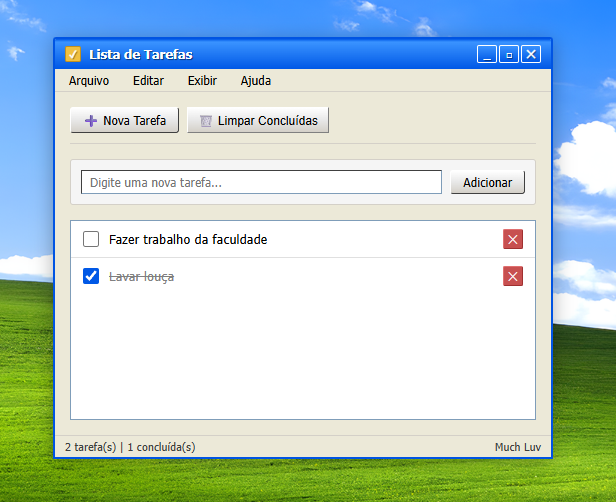

# 📝 XP To-Do List

> "Organize suas tarefas diárias com a interface clássica do Windows XP."

Um gerenciador de tarefas simples e objetivo desenvolvido com HTML, CSS e JavaScript puro. O projeto traz uma proposta visual nostálgica baseada no design do Windows XP, oferecendo uma experiência interativa, organizada e direta para o controle de atividades do dia a dia.

---

## 🎲 Funcionalidades

* **Gestão de Atividades:** Criação e adição dinâmica de novas tarefas na lista de forma instantânea.
* **Controle de Status:** Opção para marcar tarefas como concluídas e remoção individual de itens.
* **Limpeza em Lote:** Botão dedicado para limpar todas as tarefas concluídas de uma única vez.
* **Métricas de Progresso:** Contadores em tempo real que exibem o total de tarefas criadas e quantas já foram finalizadas.

---

## 🎨 Diferenciais de UI/UX

* **Estética Temática:** Interface desenhada com a paleta de cores icônica e elementos visuais inspirados no sistema operacional clássico.
* **Feedback Dinâmico:** Atualização visual imediata nos contadores e na lista assim que uma tarefa é adicionada, concluída ou removida.

---

## 🔧 Acesse o projeto [Clicando Aqui](https://ashmuchluv.github.io/xp-todo-list/)

  

